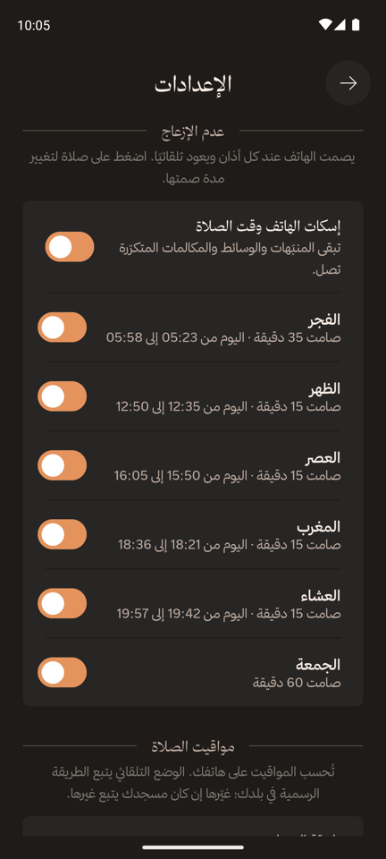

<div dir="rtl">

# منبّه الصلاة (Prayer Notifier)

[English](README.md) · **العربية** · الإصدار 0.3.3 · [سجل التغييرات](CHANGELOG.ar.md)

تطبيق لمواقيت الصلاة على أندرويد يضع الخصوصية أولًا. تُحسب المواقيت على هاتفك من موقع الشمس، فيعمل دون إنترنت لأي تاريخ، ولا يملك التطبيق إذن الإنترنت أصلًا. تذكير قبل كل صلاة، وعدم الإزعاج وقت الصلاة، والجمعة يوم الجمعة، بالعربية والإنجليزية. دون إعلانات ولا إحصاءات ولا تتبّع.

ما زالت Google حاضرة حاليًا في تحديد موقعك وتسميته؛ [الخصوصية](docs/privacy.ar.md) تشرح ذلك بدقة وكيف تتجنّبه، و[TODO](TODO.md#privacy) فيه خطة إزالتها.

<p>
  
  
  
  
</p>

## المزايا

- **تُحسب على هاتفك**: لأي تاريخ، دون إنترنت، ودون تنزيل. وتتبع طريقة الحساب ووقت العصر الجهة الرسمية في بلدك، أو الطريقة التي يتبعها مسجدك.
- **تذكير قبل كل صلاة**: تنبيه هادئ عند الوقت أو قبله من 5 إلى 30 دقيقة، لكل الصلوات دفعة واحدة أو لكل صلاة على حدة.
- **عدم الإزعاج وقت الصلاة**: يُفعَّل عند كل أذان ويتوقف تلقائيًا بعد 35 دقيقة للفجر، وساعة للجمعة، و25 دقيقة لغيرهما، أو المدة التي تختارها.
- **الجمعة يوم الجمعة**: بتذكير خاص بها (قبل 30 دقيقة افتراضيًا) وبصمت خاص بها.
- **تعديل المواقيت**: قدّم الصلاة أو أخّرها حتى 30 دقيقة لتوافق مسجدك، وأنت ترى وقت اليوم يتغيّر، وعدّل التاريخ الهجري حتى يومين.
- **عدّ تنازلي وتقويم**: الصلاة التالية، والتاريخان الهجري والميلادي، وأي يوم تختاره، وأماكن محفوظة.
- **العربية والإنجليزية**، من اليمين إلى اليسار بالعربية، بتصميم مستوحى من [Wonderous](https://wonderous.app).

## الوثائق

| الوثيقة | محتواها |
|---|---|
| [كيف يعمل](docs/how-it-works.ar.md) | كل ميزة بالتفصيل، والحساب وطرقه حسب البلد، والتذكيرات، وعدم الإزعاج، والجمعة، والأذونات |
| [الخصوصية](docs/privacy.ar.md) | ما لا يغادر الهاتف أبدًا، وأين ما زالت Google حاضرة، وكيف تشارك أقل اليوم |
| [التطوير](docs/development.ar.md) | البناء، ونسخ الإصدار الموقّعة، وأوامر التجربة، ومحاكاة الأيام الكثيرة، وبنية المشروع، وخط ثمانية الاختياري |
| [سجل التغييرات](CHANGELOG.ar.md) | ما تغيّر في كل إصدار |
| [TODO](TODO.md) | العمل المخطط له، بدءًا بإزالة خدمات Google (بالإنجليزية) |

## البدء السريع

```sh
git clone https://github.com/abderrahmane-harouat/prayer-notifier.git
cd prayer-notifier
git config core.hooksPath .githooks   # يمنع إيداع المفاتيح والخطوط المرخّصة
./gradlew :app:installDebug           # البناء والتثبيت على جهاز أو محاكٍ
```

يتطلب JDK من 17 إلى 21 وAndroid SDK 36. يعمل التطبيق على أندرويد 8.0 فأحدث، ويتطلب «عدم الإزعاج» وقت الصلاة أندرويد 10. المزيد في [التطوير](docs/development.ar.md).

## شكر وإسناد

- حساب المواقيت: مكتبة [Adhan](https://github.com/batoulapps/adhan-java) من Batoul Apps (رخصة MIT)؛ وقيم طرق الحساب من [واجهة Aladhan](https://aladhan.com/prayer-times-api)
- إلهام التصميم: [Wonderous](https://wonderous.app) من gskinner
- الأيقونات: [Phosphor Icons](https://phosphoricons.com) (رخصة MIT)
- الخطوط (رخصة SIL Open Font): Yeseva One وTenor Sans وRaleway وأميري
- الخط العربي (اختياري، غير مرفق): [ثمانية](https://font.thmanyah.com/)

## الترخيص

الشيفرة منشورة بموجب [رخصة MIT](LICENSE) © 2026 Abderrahmane Harouat. وتحتفظ الخطوط والأيقونات المرفقة برخصها الخاصة، ونصوصها في `app/src/main/assets/licenses/`. أما خط ثمانية فليس جزءًا من هذا المستودع ولا تشمله رخصة MIT.

</div>
