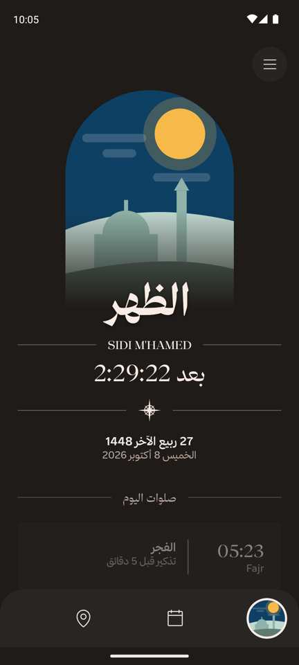
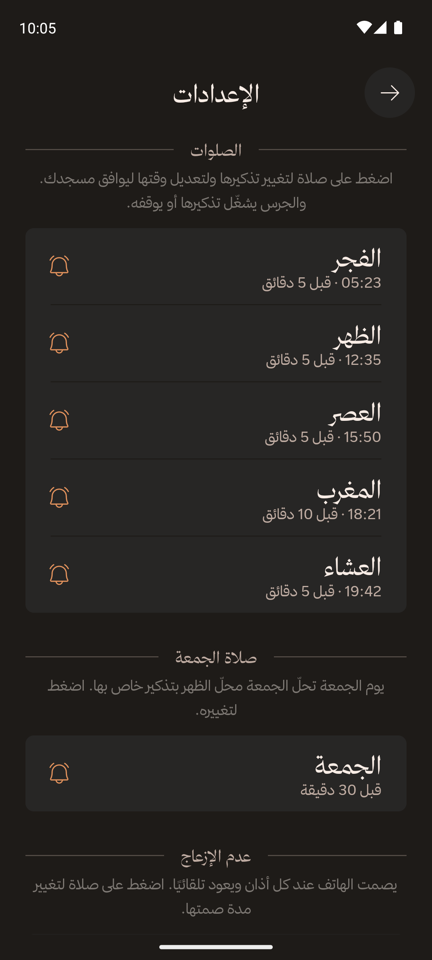
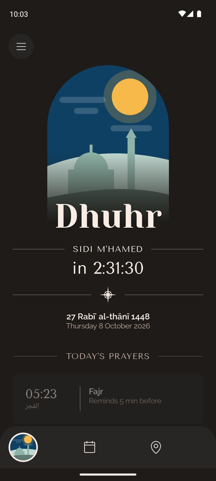

<div dir="rtl">

# منبّه الصلاة (Prayer Notifier)

[English](README.md) · **العربية** · الإصدار 0.3.1

منبّه لمواقيت الصلاة على أندرويد يعمل دون إنترنت تمامًا. يعرض مواقيت الصلوات الخمس حسب موقعك ويرسل تذكيرًا قبل كل صلاة. تُحسب المواقيت على هاتفك من موقع الشمس، فلا شيء يُنزَّل، وتعمل لأي تاريخ، بإنترنت أو دونه. متوفّر بالعربية والإنجليزية، دون إعلانات ولا إحصاءات ولا تتبّع.

الخصوصية أولًا: لا يملك التطبيق إذن الإنترنت، والهدف ألّا يُؤتمن أحد على موقعك، لا Google ولا أندرويد نفسه قدر الإمكان. ما زالت بعض خدمات Google مستخدمة حاليًا؛ قسم [الخصوصية](#الخصوصية) يذكر كلًّا منها بدقة، و[TODO.md](TODO.md#privacy) يذكر خطة إزالتها.

<p>
  
  
  
</p>

## المزايا

- **مواقيت الصلاة حسب موقعك**: الفجر والظهر والعصر والمغرب والعشاء، انطلاقًا من موقعك عبر GPS. يمكنك حفظ أماكن والتنقّل بينها.
- **عدّ تنازلي للصلاة التالية** مع التاريخين الهجري والميلادي. تصفّح أي يوم آخر، ثم عُد إلى اليوم بضغطة واحدة.
- **تذكيرات لا منبّهات**: تنبيه عادي بصوت هادئ قبل كل صلاة، بصياغة تطابق إعدادك («تبقّت 5 دقائق على صلاة المغرب»، أو «حان وقت صلاة المغرب» عند اختيار «عند الوقت»). اختر وقت التذكير لكل الصلوات دفعة واحدة (عند الوقت، أو قبل 5 أو 10 أو 15 أو 30 دقيقة) أو لكل صلاة على حدة، وفعّل أي صلاة أو أوقفها.
- **عدم الإزعاج وقت الصلاة**: مفعّل افتراضيًا. يصمت الهاتف عند كل أذان ويعود تلقائيًا: بعد 35 دقيقة من الفجر، وساعة من الجمعة، و15 دقيقة من باقي الصلوات افتراضيًا، ويمكنك ضبط مدة كل صلاة من 5 دقائق إلى ساعتين. يمكنك إيقافه كليًا أو لكل صلاة على حدة. وتعرض الإعدادات صمت اليوم لكل صلاة («اليوم من 12:35 إلى 12:50»)؛ وما دام إذن «عدم الإزعاج» غير ممنوح تبقى بطاقة «عدم الإزعاج» كلها، ومعها المفتاح الرئيسي، باهتة ومقفلة، إذ لا يمكن أن يعمل شيء منها. وتبقى المنبّهات والوسائط والمكالمات المتكرّرة (من يتصل مرتين خلال 15 دقيقة) تصل، ولا يمسّ التطبيق أبدًا وضع «عدم الإزعاج» الذي تفعّله بنفسك.
- **الجمعة يوم الجمعة**: تحلّ الجمعة محلّ الظهر، بتذكير خاص بها (قبل 30 دقيقة افتراضيًا، ليتسع الوقت للذهاب إلى المسجد) وبساعة صمت خاصة بها.
- **تعديل المواقيت**: قدّم أي صلاة أو أخّرها حتى 30 دقيقة، وعدّل التاريخ الهجري يومين زيادةً أو نقصًا، لتوافق مسجدك أو رؤية الهلال في بلدك. وأثناء تعديل صلاة يظهر وقتها اليوم ويتغيّر مع كل ضغطة («12:35 ‹ 12:40»)، فتطابق مسجدك دون الرجوع للتحقق.
- **تُحسب على هاتفك**: لا حاجة إلى الإنترنت أبدًا، ولا حدّ للتاريخ. تتبع طريقة الحساب الجهة الرسمية في بلدك (مثل وزارة الشؤون الدينية في الجزائر، وأم القرى في السعودية، وديانت في تركيا)، أو اختر طريقة أخرى من الإعدادات لتوافق مسجدك. ووقت العصر يتبع البلد كذلك: الوقت الحنفي (وهو أكثر تأخرًا) في باكستان والهند وبنغلاديش وأفغانستان، ووقت الجمهور في غيرها، ويمكن اختيار أيٍّ منهما من الإعدادات.
- **إعدادات تشرح نفسها**: كل قسم يذكر الغرض منه، وكل صلاة تعرض وقتها اليوم بجانب تذكيرها («05:23 · قبل 5 دقائق»). اضغط على صلاة لتغيير تذكيرها أو تعديل وقتها.
- **العربية والإنجليزية**: واجهة كاملة من اليمين إلى اليسار بالعربية. اختر اللغة من داخل التطبيق أو من إعدادات لغة التطبيقات في أندرويد (أندرويد 13 فأحدث).
- **تصميم بروح كتاب المتحف**: ألوان داكنة دافئة، وعناوين بخط كلاسيكي، ولوحة مرسومة لكل صلاة، مستوحاة من تطبيق [Wonderous](https://wonderous.app). وتظهر شاشة افتتاحية متحركة لقصر الحمراء عند التشغيل (أندرويد 12 فأحدث).

## كيف يعمل

| الجزء | التفاصيل |
|---|---|
| المواقيت | تُحسب على الهاتف بمكتبة [Adhan](https://github.com/batoulapps/adhan-java) من إحداثياتك والتاريخ: الفجر والعشاء من زاوية الشمس تحت الأفق، والظهر عند الزوال، والعصر حين يساوي الظلُّ طولَ الشيء مع ظلّ الزوال (الشافعي والمالكي والحنبلي) أو مثليه (الحنفي)، والمغرب عند الغروب. وتُعرض بتوقيت المكان. |
| طريقة الحساب | تُختار حسب بلد المكان (`data/calculation/CountryMethods.kt`): طريقة الجهة الرسمية في البلد إن وُجدت (الجزائر، المغرب، تونس، مصر، أم القرى، الإمارات، قطر، الكويت، الأردن، تركيا، إيران، باكستان، روسيا، فرنسا، البرتغال، سنغافورة، ماليزيا، إندونيسيا، وISNA للولايات المتحدة وكندا)، وإلا فالطريقة المعتادة في المنطقة (المصرية لأفريقيا، وأم القرى لشبه الجزيرة العربية، وكراتشي لجنوب آسيا)، وإلا فرابطة العالم الإسلامي. والعصر الحنفي في باكستان والهند وبنغلاديش وأفغانستان، وعصر الجمهور في غيرها. الزوايا وفروق الدقائق مطابقة لطرق [واجهة Aladhan](https://aladhan.com/prayer-times-api) التي كان التطبيق يستخدمها، واختبارات الوحدة تتحقق من النتائج مقارنةً بـAladhan بفارق لا يتجاوز دقيقة. ويمكنك اختيار أي طريقة وأي وقت للعصر بنفسك من الإعدادات. |
| البلد | من خدمة Geocoder عند تحديد الموقع؛ ودون إنترنت من بلد شبكة الجوال أو من المنطقة الزمنية للهاتف. ولا يُستنتج أبدًا من لغة الهاتف. |
| التاريخ الهجري | تقويم أم القرى المدمج في أندرويد، مع تعديلك (±يومان). |
| التذكيرات | تُجدوَل عبر `AlarmManager` كتنبيهات عادية (دون واجهة منبّه ولا تنبيه بملء الشاشة). بتوقيت دقيق حين يسمح أندرويد بذلك، وإلا فإنها تصل مع ذلك وقد تتأخر بضع دقائق. ويُعاد تخطيطها كل ليلة بعد منتصف الليل وبعد إعادة التشغيل، لليوم السابق واليوم معًا: ففي أقصى الشمال صيفًا قد يقع العشاء بعد منتصف الليل وهو تابع لليوم السابق. واليوم الذي يتعذّر حسابه (نهار القطب أو ليله) يُتخطّى دون أن ينقطع التخطيط الليلي. |
| عدم الإزعاج | قاعدة تلقائية خاصة بالتطبيق باسم «وقت الصلاة»، ظاهرة في إعدادات «عدم الإزعاج» في أندرويد (الأوضاع في أندرويد 15 فأحدث). تُفعَّل عند الأذان وتُوقَف عند النهاية بمنبّهات دقيقة؛ ويُحفظ وقت النهاية، فيُنهى الصمت أو يُستأنف كما ينبغي إن أُعيد تشغيل الهاتف أثناءه. ويدوم كل صمت المدة المضبوطة لتلك الصلاة (من 5 إلى 120 دقيقة؛ 35 للفجر و60 للجمعة و15 لغيرهما افتراضيًا). والفترات المتداخلة (صمت مغرب طويل يبلغ العشاء، أو ساعة الجمعة حين تبلغ العصر في شتاء الشمال) تُدمج في صمت واحد. والتذكير «عند الوقت» يُطلق قبيل بدء الصمت فيُسمع. يتطلب أندرويد 10 فأحدث وإذن «عدم الإزعاج» الذي لا يمنحه أندرويد إلا من شاشة إعداداته. |
| الجمعة | يوم الجمعة: وقت الظهر (بتعديل الظهر) مع إعدادات التذكير والصمت الخاصة بالجمعة. |
| الموقع | قراءة واحدة لموقعك عبر Fused Location Provider من خدمات Google Play، ويُسمّى المكان عبر خدمة Geocoder في أندرويد (تجيب عنها خوادم Google في أغلب الهواتف)، أو بإحداثياته إن تعذّر الاسم. راجع [الخصوصية](#الخصوصية). |

### الأذونات

| الإذن | السبب |
|---|---|
| الموقع (أثناء استخدام التطبيق) | لأن المواقيت تعتمد على مكانك. يُطلب عند أول تشغيل. |
| التنبيهات (أندرويد 13 فأحدث) | لعرض تذكيرات الصلاة. يُطلب بعد ظهور المواقيت على الشاشة. |
| التوقيت الدقيق (`USE_EXACT_ALARM`، و`SCHEDULE_EXACT_ALARM` على أندرويد 12) | يُمنح تلقائيًا لتصل التذكيرات في دقيقتها، ولا تظهر لك أبدًا شاشة إذن «المنبّهات». |
| إذن «عدم الإزعاج» (`ACCESS_NOTIFICATION_POLICY`) | لإسكات الهاتف وقت الصلاة. لا يمنحه أندرويد إلا من شاشة «إذن عدم الإزعاج» في إعداداته؛ يفتحها التطبيق لك مرة، وتعرض الإعدادات تنبيهًا ما دام غير ممنوح. |
| التشغيل عند بدء الهاتف | لإعادة جدولة التذكيرات، وإنهاء الصمت أو استئنافه، بعد إعادة التشغيل. |

لا إذن بالإنترنت: راجع [الخصوصية](#الخصوصية) لمعرفة ما يعنيه ذلك وما زال يمرّ عبر Google.

## الخصوصية

الهدف تطبيق صلاة لا يأتمن أحدًا على مكانك: لا المطوّر، ولا Google، ولا أندرويد نفسه قدر الإمكان. لم يبلغ ذلك كاملًا بعد. يذكر هذا القسم بدقة ما يحدث اليوم، ويتابع [TODO.md](TODO.md#privacy) العمل لإزالة كل اعتماد متبقٍّ.

### ما لا يفعله التطبيق أبدًا

- **لا يستطيع الاتصال بالإنترنت.** ليس لديه إذن الإنترنت، فيمنع أندرويد أي اتصال بالشبكة قد يحاوله. لا يمكن إرسال أي شيء إلى أي مكان، ولو خطأً أو عبر مكتبة.
- لا حسابات ولا إحصاءات ولا تقارير أعطال ولا إعلانات ولا متتبّعات.
- المواقيت وطريقة الحساب والتاريخ الهجري والتذكيرات كلها تُحسب على الهاتف.

### ما يبقى على الهاتف

مكانك الحالي والأماكن المحفوظة (الاسم والإحداثيات والبلد والمنطقة الزمنية) وإعداداتك، في المساحة الخاصة بالتطبيق. النسخ الاحتياطي في أندرويد معطّل (`allowBackup="false"`)، فلا يُنسخ شيء منها إلى Google Drive ولا إلى هاتف جديد، وحذف التطبيق يمحوها كلها.

### أين ما زالت Google حاضرة

| ماذا | كيف تدخل Google | ما الذي قد تعرفه Google |
|---|---|---|
| تحديد موقعك | يطلب التطبيق الموقع من Fused Location Provider في خدمات Google Play (`FusedPositionProvider.kt`). | إن كانت «دقة الموقع من Google» مفعّلة، تستخدم خدمات Play أيضًا شبكات الواي فاي وأبراج الاتصال القريبة وقد ترسلها إلى Google. وإن كانت معطّلة، يأتي الموقع من GPS على الهاتف. |
| تسمية المكان ومعرفة بلده | خدمة `Geocoder` في أندرويد (`AndroidGeocoderProvider.kt`)، وتجيب عنها خوادم Google في الهواتف التي فيها خدمات Google Play. | إحداثياتك، مرة واحدة عند كل تحديث للموقع. ولا شيء إن كان الهاتف دون إنترنت. |
| نافذة «تفعيل موقع الجهاز؟» | تعرضها خدمات Google Play حين يكون الموقع معطّلًا. | أن التطبيق تحقّق من إعداد الموقع. دون إحداثيات. |
| مكتبة `play-services-location` | شيفرة مغلقة المصدر من Google داخل التطبيق، للتواصل مع خدمات Play. | لا شيء مباشرة: تعمل داخل التطبيق الذي لا يستطيع الاتصال بالإنترنت. لكن لا يمكن مراجعتها. |

**لا يستطيع التطبيق بعدُ تحديد الموقع على الهواتف الخالية من خدمات Google Play** (GrapheneOS دون Play المعزولة، وLineageOS دون microG): يفشل طلب الموقع (جُرّب ذلك بتعطيل خدمات Play). المكان المحفوظ مسبقًا يبقى يعمل، لكن التثبيت الجديد هناك لا يملك طريقة لتحديد مكان. وهذا أول بند في [TODO.md](TODO.md#privacy).

### كيف تشارك أقل اليوم

- عطّل **دقة الموقع من Google** (الإعدادات ← الموقع ← خدمات الموقع). يأتي الموقع حينها من GPS وحده. في الخارج تبقى الدقة نفسها، وفي الداخل قد تتأخر القراءة الأولى.
- حدّث موقعك **دون إنترنت** (وضع الطيران، أو الواي فاي والبيانات معطّلة). لا تصل خدمة Geocoder إلى Google، فيُسمّى المكان بإحداثياته ويُعرف البلد من شبكة الجوال أو المنطقة الزمنية. والمواقيت هي نفسها تمامًا.
- بعد تحديد مكانك لا يحتاج التطبيق شيئًا آخر: التذكيرات والمواقيت تعمل والموقع معطّل.
- يُفعَّل «عدم الإزعاج» عبر أندرويد على الهاتف نفسه؛ لا يخرج شيء متعلق به من الهاتف.

### ما لا بد من ائتمان أندرويد عليه

كل تطبيق يعمل على نظام تشغيله ويعتمد عليه: عتاد GPS ونظام الموقع، والساعة والمنطقة الزمنية، والمنبّهات التي تطلق التذكيرات، والتنبيهات، والمساحة الخاصة بالتطبيق. تعمل هذه الأجزاء على الهاتف، ولا يرسل إليها التطبيق إلا ما تحتاجه (لا تخرج الإحداثيات من التطبيق إلا عبر الخدمات المذكورة أعلاه). ويقرأ التطبيق أيضًا بلد شبكة الجوال ومنطقة المنطقة الزمنية، وكلاهما يُجاب عنه على الهاتف دون طلب شبكي. أما ما يفعله نظام التشغيل، أو نسخة الشركة المصنّعة منه، من تلقاء نفسه فلا يمكن التحقق منه من داخل تطبيق. ونسخة أندرويد تركّز على الخصوصية مثل GrapheneOS تقلّل ذلك، ويسعى التطبيق إلى أن يعمل عليها كاملًا.

## البناء والتشغيل

المتطلبات: Android Studio (أو سطر الأوامر)، و**JDK من 17 إلى 21** (الإصدارات الأحدث لا يدعمها إصدار Gradle/AGP المستخدم)، وAndroid SDK 36. يعمل التطبيق على أندرويد 8.0 (API 26) فأحدث؛ ويتطلب «عدم الإزعاج» وقت الصلاة أندرويد 10.

<div dir="ltr">

```sh
git clone https://github.com/abderrahmane-harouat/prayer-notifier.git
cd prayer-notifier
./gradlew :app:assembleDebug        # build the APK
./gradlew :app:testDebugUnitTest    # run the unit tests
./gradlew :app:installDebug         # install on a connected device or emulator
```

</div>

أو افتح المجلد في Android Studio واضغط **Run**.

قبل أي commit، فعّل أداة الحماية التي تمنع رفع مفاتيح التوقيع وكلمات المرور وملفات الخطوط المرخّصة (المستودع عام) بالأمر: `git config core.hooksPath .githooks`

### بناء نسخة الإصدار الموقّعة

تُوقَّع نسخ الإصدار فقط على الأجهزة التي تملك المفتاح الخاص. أنشئ ملف `keystore.properties` في جذر المشروع (مستثنى من Git) يشير إلى مخزن مفاتيح محفوظ **خارج** المستودع (الحقول: `storeFile` و`storePassword` و`keyAlias` و`keyPassword`)، ثم شغّل `./gradlew :app:assembleRelease`. ودون هذا الملف تُبنى نسخة الإصدار أيضًا لكن دون توقيع.

### تجربة تذكير (نسخ التطوير فقط)

تُثبَّت نسخ التطوير باسم الحزمة `com.example.prayernotifier.debug` إلى جانب نسخة الإصدار، فيحتفظ الهاتف بتذكيراته الحقيقية أثناء تجربة نسخة التطوير. وتتضمّن أداة صغيرة تطلق تذكيرات حقيقية وفترات صمت بالمسار نفسه للمجدولة دون تغيير ساعة الهاتف، وليست جزءًا من نسخة الإصدار. الأوامر في قسم [Test a reminder](README.md#test-a-reminder-debug-builds-only) في النسخة الإنجليزية.

### محاكاة أيام كثيرة

يشغّل الاختبار `MultiDaySimulationTest` المخطِّط والمجدوِل ومعالجة المنبّهات الحقيقية على سنوات من الأيام في ثوانٍ، بساعة افتراضية وطابور منبّهات يتصرّف مثل أندرويد. ويتحقق من كل تذكير وكل بداية ونهاية لـ«عدم الإزعاج» مقابل الأوقات المستخرجة من المواقيت: عشر سنوات في الجزائر العاصمة، وثلاث في لندن (التوقيت الصيفي) وأوسلو (العشاء بعد منتصف الليل) ومكة (رمضان)، وسنتان في ترومسو (نهار القطب وليله)، ومن 2099 إلى 2101، مع إعدادات متنوعة منها مدد صمت معدّلة، وإعادات تشغيل وإعادات تخطيط عشوائية. نحو 180 ألف حدث، كلٌّ بالدقيقة.

### اختياري: خط ثمانية للعربية

صُمّمت الواجهة العربية لـ[خط ثمانية](https://font.thmanyah.com/). ترخيصه يسمح بتضمينه داخل التطبيق لكنه **يمنع استضافة ملفات الخط**، لذلك ليست موجودة في هذا المستودع. ودونها تستخدم العربية خط «أميري» المرفق، ويعمل كل شيء آخر كما هو.

للبناء بخط ثمانية:

1. نزّل الخط من [font.thmanyah.com](https://font.thmanyah.com/) (مجاني؛ يطلب الموقع بريدًا إلكترونيًا).
2. انسخ هذه الملفات الخمسة من مجلدات `otf/` إلى `app/src/main/res-licensed/font/` (مجلد مستثنى من Git) بالأسماء التالية:

   | من ملف التنزيل | احفظه باسم |
   |---|---|
   | `thmanyahserifdisplay-Regular.otf` | `thmanyah_serif_display.otf` |
   | `thmanyahserifdisplay-Bold.otf` | `thmanyah_serif_display_bold.otf` |
   | `thmanyahsans-Regular.otf` | `thmanyah_sans.otf` |
   | `thmanyahsans-Medium.otf` | `thmanyah_sans_medium.otf` |
   | `thmanyahsans-Bold.otf` | `thmanyah_sans_bold.otf` |

3. أعد البناء، وسيكتشف التطبيق الملفات تلقائيًا.

## بنية المشروع

راجع قسم [Project structure](README.md#project-structure) في النسخة الإنجليزية؛ أسماء الملفات والمجلدات هي نفسها.

باختصار: الشيفرة في `app/src/main/java/com/example/prayernotifier/` (البيانات في `data/`، والتذكيرات في `data/notifications/`، واللغة في `i18n/`، والواجهات في `ui/`)، والنصوص العربية في `app/src/main/res/values-ar/`. ومجلد `archive/` يحوي النسخة الأولى من التطبيق بـFlutter (غير مُحدَّثة).

## شكر وإسناد

- حساب المواقيت: مكتبة [Adhan](https://github.com/batoulapps/adhan-java) من Batoul Apps (رخصة MIT، نصّها في `app/src/main/assets/licenses/`)؛ وقيم طرق الحساب من [واجهة Aladhan](https://aladhan.com/prayer-times-api)
- إلهام التصميم: [Wonderous](https://wonderous.app) من gskinner
- الأيقونات: [Phosphor Icons](https://phosphoricons.com) (رخصة MIT، نصّها في `app/src/main/assets/licenses/`)
- الخطوط (رخصة SIL Open Font، نصوصها في `app/src/main/assets/licenses/`): Yeseva One وTenor Sans وRaleway وأميري
- الخط العربي (اختياري، غير مرفق): [ثمانية](https://font.thmanyah.com/)

## الترخيص

الشيفرة منشورة بموجب [رخصة MIT](LICENSE) © 2026 Abderrahmane Harouat.

تحتفظ المواد المرفقة من أطراف أخرى برخصها الخاصة: الخطوط (رخصة SIL Open Font) وأيقونات Phosphor (رخصة MIT)، ونصوص رخصها في `app/src/main/assets/licenses/`. أما خط ثمانية فليس جزءًا من هذا المستودع ولا تشمله رخصة MIT.

</div>
