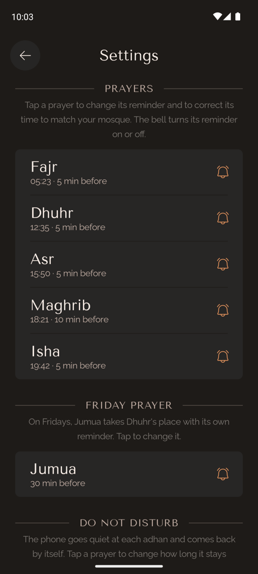
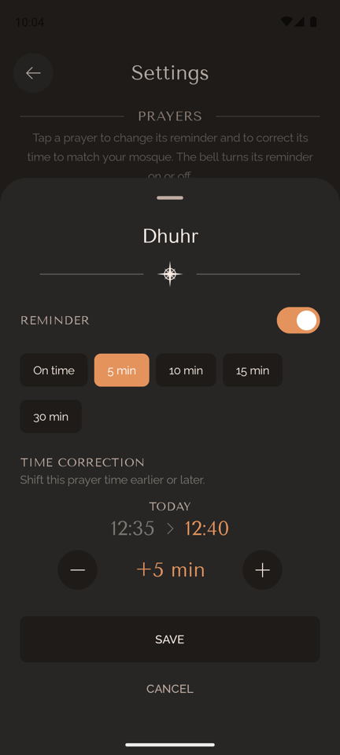
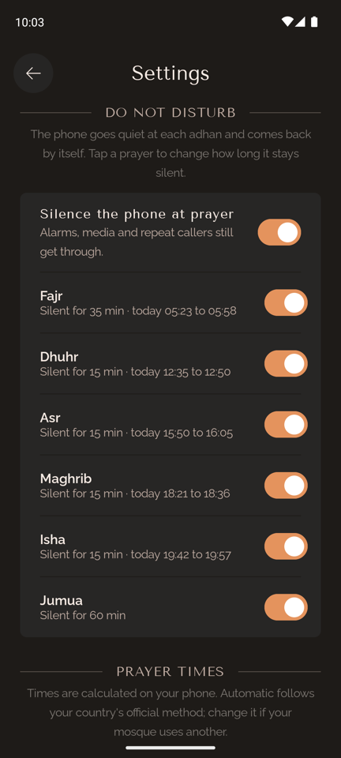

# Prayer Notifier

**English** · [العربية](README.ar.md) · Version 0.3.1

A prayer times notifier for Android that works fully offline. It shows the five daily prayer times for where you are and sends a reminder before each prayer. The times are calculated on your phone from the sun's position, so there is nothing to download and it works for any date, with or without internet. Available in Arabic and English, with no ads, no analytics and no tracking.

Privacy comes first: the app has no internet permission, and the aim is to trust no one with your location, not Google and as little as possible Android itself. A few Google services are still involved for now; [Privacy](#privacy) lists each one exactly, and [TODO.md](TODO.md#privacy) the plan to remove them.

<p>
  
  
  
  
  
</p>

## Features

- **Prayer times for your location**: Fajr, Dhuhr, Asr, Maghrib and Isha, from your GPS position. Save places and switch between them.
- **Countdown to the next prayer**, with the Hijri and Gregorian dates. Browse any other day, and go back to today with one tap.
- **Reminders, not alarms**: a normal notification with a soft sound before each prayer, worded to match your setting ("5 minutes until Maghrib", or "Time for Maghrib prayer" when set to on time). Choose the lead time for all prayers at once (on time, 5, 10, 15 or 30 minutes), or per prayer, and turn any prayer on or off.
- **Do Not Disturb at prayer time**: on by default. The phone goes quiet at each adhan and comes back by itself: 35 minutes after Fajr, 1 hour after Jumua, 15 minutes after the others by default, and you can set each prayer anywhere from 5 minutes to 2 hours. Switch it off entirely, or per prayer. Settings shows today's silence for each prayer ("today 12:35 to 12:50"); until Android grants Do Not Disturb access, the whole Do Not Disturb card, main switch included, is greyed out and locked, since none of it could take effect. Alarms, media and repeat callers (someone calling twice within 15 minutes) still get through, and your own Do Not Disturb is never touched.
- **Jumua on Fridays**: Dhuhr becomes Jumua, with its own reminder (30 minutes before by default, so there is time to get to the mosque) and its own hour of silence.
- **Time corrections**: shift any prayer by up to ±30 minutes, and the Hijri date by ±2 days, to match your local mosque or moon sighting. While you adjust a prayer, its time today is shown and updates with each tap ("12:35 › 12:40"), so you can match the mosque without going back to check.
- **Calculated on your phone**: no internet needed, ever, and no date limit. The calculation method follows your country's official authority (for example Algeria's ministry in Algeria, Umm al-Qura in Saudi Arabia, Diyanet in Turkey), or pick another one in Settings to match your mosque. Asr follows the country too: the later Hanafi time in Pakistan, India, Bangladesh and Afghanistan, the standard time elsewhere, and either can be chosen in Settings.
- **Settings that explain themselves**: every section says what it is for, and each prayer shows today's time next to its reminder ("05:23 · 5 min before"). Tap a prayer to change its reminder or correct its time.
- **English and Arabic**: full right-to-left layout in Arabic. Pick the language in the app, or in Android's per-app language settings (Android 13+).
- **A museum-book design**: warm dark tones, classical serif titles and a hand-drawn scene for each prayer, inspired by the [Wonderous](https://wonderous.app) app. An animated Alhambra splash plays on launch (Android 12+).

## How it works

| Part | Details |
|---|---|
| Prayer times | Calculated on the device with the [Adhan](https://github.com/batoulapps/adhan-java) library from your coordinates and the date: Fajr and Isha from the sun's angle below the horizon, Dhuhr at solar noon, Asr when a shadow equals its object plus its noon shadow (Shafi'i, Maliki, Hanbali) or twice its object (Hanafi), Maghrib at sunset. Shown in the place's time zone. |
| Calculation method | Chosen by the place's country (`data/calculation/CountryMethods.kt`): the country's own authority where there is one (Algeria, Morocco, Tunisia, Egypt, Umm al-Qura, UAE, Qatar, Kuwait, Jordan, Turkey, Iran, Pakistan, Russia, France, Portugal, Singapore, Malaysia, Indonesia, ISNA for the US and Canada), otherwise the region's usual method (Egyptian for Africa, Umm al-Qura for the Arabian Peninsula, Karachi for South Asia), otherwise Muslim World League. Hanafi Asr in Pakistan, India, Bangladesh and Afghanistan, standard Asr elsewhere. The angles and minute offsets match the [Aladhan API](https://aladhan.com/prayer-times-api) methods the app used before, and unit tests check the results against Aladhan within a minute. You can pick any method and Asr rule yourself in Settings. |
| Country | From the geocoder when the location is taken; offline, from the mobile network's country or the phone's time zone. Never from the language setting. |
| Hijri date | Android's built-in Umm al-Qura calendar, with your ±2 day correction. |
| Reminders | Scheduled with `AlarmManager` as plain notifications (no alarm-clock UI, no full-screen alert). Exact timing when Android allows it; otherwise they still arrive, possibly a few minutes late. Re-planned every night just after midnight and after a reboot, for yesterday and today together: far north in summer, Isha can fall after midnight and still belongs to the day before. A day that can't be calculated (polar day or night) is skipped without breaking the nightly re-plan. |
| Do Not Disturb | The app's own automatic rule, named "Prayer time" and visible in Android's Do Not Disturb settings (Modes on Android 15+). It is switched on at the adhan and off at the end by exact alarms; the end time is saved, so a silence that was on during a restart is ended or resumed correctly. Each silence lasts the length set for that prayer (5 to 120 minutes; 35 for Fajr, 60 for Jumua and 15 for the others by default). Silences that overlap (a long Maghrib silence reaching Isha, or Jumua's hour reaching Asr in a northern winter) join into one. An "on time" reminder fires just before the silence starts, so it is still heard. Needs Android 10 or later and Do Not Disturb access, which Android grants only from its settings screen. |
| Jumua | On Fridays, Dhuhr's time (with Dhuhr's correction) under Jumua's own reminder and silence settings. |
| Location | One fix through Google Play services' Fused Location Provider, named with Android's geocoder (Google's servers on most phones), or by its coordinates when no name is found. See [Privacy](#privacy). |

### Permissions

| Permission | Why |
|---|---|
| Location (while using the app) | Prayer times depend on where you are. Asked on first launch. |
| Notifications (Android 13+) | To show prayer reminders. Asked once the prayer times are on screen. |
| Exact alarms (`USE_EXACT_ALARM`, and `SCHEDULE_EXACT_ALARM` on Android 12) | Granted automatically, so reminders arrive on the minute. Never shown to you as an "alarms" permission screen. |
| Do Not Disturb access (`ACCESS_NOTIFICATION_POLICY`) | To silence the phone at prayer time. Android grants it only from its own "Do Not Disturb access" screen; the app opens it for you once, and Settings shows a banner while it is missing. |
| Run at startup | To re-plan reminders, and end or resume a silence, after the phone restarts. |

No internet permission: see [Privacy](#privacy) for what that means and what still involves Google.

## Privacy

The goal is a prayer app that trusts no one with where you are: not the developer, not Google, and as little as possible Android itself. It is not fully there yet. This section says exactly what happens today, and [TODO.md](TODO.md#privacy) tracks the work to remove each remaining dependency.

### What the app never does

- **It cannot go online.** It has no internet permission, so Android blocks every network connection it might try to open. Nothing can be sent anywhere, even by mistake or by a library.
- No accounts, analytics, crash reporting, ads or trackers.
- Prayer times, the calculation method, the Hijri date and the reminders are all worked out on the phone.

### What stays on the phone

Your current place and saved places (name, coordinates, country, time zone) and your settings, in the app's private storage. Android backup is turned off (`allowBackup="false"`), so none of it is copied to Google Drive or to a new phone, and uninstalling the app deletes all of it.

### Where Google is still involved

| What | How Google is involved | What Google can learn |
|---|---|---|
| Getting your position | The app asks Google Play services' Fused Location Provider for a fix (`FusedPositionProvider.kt`). | With "Google Location Accuracy" on, Play services also uses nearby Wi-Fi networks and cell towers and can send them to Google. With it off, the fix comes from GPS on the phone. |
| Naming the place and finding its country | Android's `Geocoder` (`AndroidGeocoderProvider.kt`). On phones with Google Play services, Google's servers answer it. | Your coordinates, once each time you refresh your location. Nothing when the phone is offline. |
| The "Turn on device location?" dialog | Shown by Google Play services when location is off. | That the app checked the location setting. No coordinates. |
| The `play-services-location` library | Closed-source Google code inside the app, used to talk to Play services. | Nothing directly: it runs inside the app, which cannot go online. But it cannot be audited. |

**The app cannot get a location yet on phones without Google Play services** (GrapheneOS without sandboxed Play, LineageOS without microG): the location request fails (tested with Play services disabled). A place saved earlier keeps working, but a fresh install there has no way to set one. This is the first item in [TODO.md](TODO.md#privacy).

### How to share less today

- Turn off **Google Location Accuracy** (Settings → Location → Location services). The position then comes from GPS only. Outdoors it is just as accurate; indoors the first fix can take longer.
- Refresh your location **without internet** (airplane mode, or Wi-Fi and data off). The geocoder can't reach Google, so the place is named by its coordinates and the country comes from the mobile network or the time zone. The prayer times are exactly the same.
- Once your place is set, the app needs nothing else: reminders and times keep working with location off.
- Do Not Disturb is switched through Android on the phone itself; nothing about it leaves the phone.

### What has to be trusted to Android

Every app runs on its operating system and depends on it: the GPS hardware and location stack, the clock and time zone, the alarms that fire reminders, notifications, and the app's private storage. These parts of Android run on the phone and the app sends them nothing beyond what they need (no coordinates leave the app except through the services listed above). The app also reads the mobile network's country and the time zone's region, both answered on the phone without a network request. What the operating system, or the phone maker's version of it, does on its own cannot be checked from inside an app. A privacy-focused Android such as GrapheneOS reduces this, and the app aims to fully work there.

## Build and run

Requirements: Android Studio (or the command line), **JDK 17–21** (newer JDKs are not supported by this Gradle/AGP version), Android SDK 36. The app runs on Android 8.0 (API 26) and later; Do Not Disturb at prayer time needs Android 10.

```sh
git clone https://github.com/abderrahmane-harouat/prayer-notifier.git
cd prayer-notifier
./gradlew :app:assembleDebug        # build the APK
./gradlew :app:testDebugUnitTest    # run the unit tests
./gradlew :app:installDebug         # install on a connected device or emulator
```

Or open the folder in Android Studio and press **Run**.

Before committing, turn on the safety check that blocks signing keys, passwords and licensed font files from ever being committed (the repository is public):

```sh
git config core.hooksPath .githooks
```

### Signed release build

Release builds are signed only on machines that have the private key. Create a `keystore.properties` file in the project root (it is git-ignored) that points to a keystore kept **outside** the repository:

```properties
storeFile=/absolute/path/to/your-release.jks
storePassword=...
keyAlias=...
keyPassword=...
```

Then run `./gradlew :app:assembleRelease`; the APK is `app/build/outputs/apk/release/app-release.apk`. Without the file, release builds still work but are unsigned.

### Test a reminder (debug builds only)

Debug builds are installed as `com.example.prayernotifier.debug`, next to the release app, so a phone can keep its real reminders while a debug build is tested. They include a small test trigger that fires real reminders and silences through the same path as scheduled ones, without changing the phone's clock (it is not part of release builds):

```sh
# All five prayers, one minute apart, starting in 10 seconds, "5 minutes before" wording
adb shell am broadcast -a com.example.prayernotifier.debug.TEST_REMINDER \
    -n com.example.prayernotifier.debug/com.example.prayernotifier.debug.TestReminderReceiver

# One prayer, custom delay and lead time (lead 0 = "it's time"); "Jumua" works too
adb shell am broadcast -a com.example.prayernotifier.debug.TEST_REMINDER \
    -n com.example.prayernotifier.debug/com.example.prayernotifier.debug.TestReminderReceiver \
    --es prayer Maghrib --ei delay 10 --ei lead 5

# Do Not Disturb on in 5 seconds, off again 60 seconds later
adb shell am broadcast -a com.example.prayernotifier.debug.TEST_REMINDER \
    -n com.example.prayernotifier.debug/com.example.prayernotifier.debug.TestReminderReceiver \
    --es prayer Asr --ei delay 5 --ei silence 60
```

For Do Not Disturb, grant access first in Android's settings (or `adb shell cmd notification allow_dnd com.example.prayernotifier.debug`).

### Multi-day simulation

`MultiDaySimulationTest` runs the real planner, scheduler and alarm handling over years of days in a few seconds, against a virtual clock and an alarm queue that behaves like Android's. It checks every reminder and every Do Not Disturb start and end against the times worked out from the prayer times: ten years in Algiers, three in London (daylight saving), Oslo (Isha after midnight) and Makkah (Ramadan), two in Tromsø (polar day and night), 2099 to 2101, varied settings including changed silence lengths, and random restarts and re-plans. About 180,000 events in all, each to the minute.

```sh
./gradlew :app:testDebugUnitTest --tests '*MultiDaySimulationTest*'
```

### Optional: the Thmanyah Arabic font

The Arabic interface is designed for [Thmanyah (خط ثمانية)](https://font.thmanyah.com/). Its license allows embedding it in an app but **forbids hosting the font files**, so they are not in this repository. Without them, Arabic uses the bundled Amiri font and everything else works the same.

To build with Thmanyah:

1. Download the font from [font.thmanyah.com](https://font.thmanyah.com/) (free; the site asks for an email).
2. Copy these five files from the `otf/` folders into `app/src/main/res-licensed/font/` (the folder is git-ignored), renamed as shown:

   | From the download | Save as |
   |---|---|
   | `thmanyahserifdisplay-Regular.otf` | `thmanyah_serif_display.otf` |
   | `thmanyahserifdisplay-Bold.otf` | `thmanyah_serif_display_bold.otf` |
   | `thmanyahsans-Regular.otf` | `thmanyah_sans.otf` |
   | `thmanyahsans-Medium.otf` | `thmanyah_sans_medium.otf` |
   | `thmanyahsans-Bold.otf` | `thmanyah_sans_bold.otf` |

3. Build again. The app detects the files automatically.

## Project structure

```
app/src/main/java/com/example/prayernotifier/
├── MainActivity.kt          # edge-to-edge, splash animation, language restore
├── data/                    # prayer times for a place and date
│   ├── calculation/         # on-device calculation, methods, country → method table
│   ├── location/            # GPS fix, place name, country and time zone
│   ├── notifications/       # reminders and Do Not Disturb: planning, alarms, receiver
│   └── persistence/         # settings storage
├── i18n/                    # app language switching, prayer and method names
└── ui/
    ├── AppShell.kt          # Home ↔ Settings with animated page transitions
    ├── home/                # Home screen and its ViewModel
    ├── settings/            # Settings screen and its ViewModel
    ├── components/Wonder.kt # design system components (arch, ornaments, buttons, chips)
    └── theme/               # colors, typography (English and Arabic), shapes
app/src/main/res/
├── values/, values-ar/      # English and Arabic strings
├── drawable/                # Phosphor icons (ph_*), launcher icon, splash animation
└── font/                    # Yeseva One, Tenor Sans, Raleway, Amiri
app/src/test/                # unit tests, including the multi-day simulation
app/src/debug/               # debug-only trigger for test reminders and silences
archive/                     # the original Flutter version of the app (not maintained)
```

## Changelog

### 0.3.1

- Without Do Not Disturb access, the whole Do Not Disturb card is locked, main switch included.
- Settings keeps its scroll position when you change something.

### 0.3.0

- Choose how long each prayer's silence lasts, from 5 minutes to 2 hours, with today's window shown.
- Settings explains every section, and each prayer shows today's time next to its reminder.

### 0.2.0

- Do Not Disturb at prayer time, on by default, and Jumua on Fridays with its own reminder and silence.
- Prayer times calculated on the phone, with the method and the Asr rule chosen by country; no internet permission.
- Today's time shown while correcting a prayer.
- Fixes: Isha after midnight in the far north, days that can't be calculated near the poles, Arabic digits in corrected times.

### 1.0

- First version: prayer times from the Aladhan API, with a 10-year download for offline use. Version numbers restarted at 0.2.0 when the app moved to on-device calculation.

## Credits

- Prayer time calculation: [Adhan](https://github.com/batoulapps/adhan-java) by Batoul Apps (MIT, license in `app/src/main/assets/licenses/`); method parameters from the [Aladhan API](https://aladhan.com/prayer-times-api)
- Design inspiration: [Wonderous](https://wonderous.app) by gskinner
- Icons: [Phosphor Icons](https://phosphoricons.com) (MIT, license in `app/src/main/assets/licenses/`)
- Fonts (SIL Open Font License, licenses in `app/src/main/assets/licenses/`): [Yeseva One](https://fonts.google.com/specimen/Yeseva+One), [Tenor Sans](https://fonts.google.com/specimen/Tenor+Sans), [Raleway](https://fonts.google.com/specimen/Raleway), [Amiri](https://fonts.google.com/specimen/Amiri)
- Arabic typeface (optional, not included): [Thmanyah](https://font.thmanyah.com/)

## License

The code is released under the [MIT License](LICENSE) © 2026 Abderrahmane Harouat.

Bundled third-party assets keep their own licenses: the fonts (SIL Open Font License) and Phosphor icons (MIT), with their license texts in `app/src/main/assets/licenses/`. The Thmanyah font is not part of this repository and is not covered by the MIT License.
